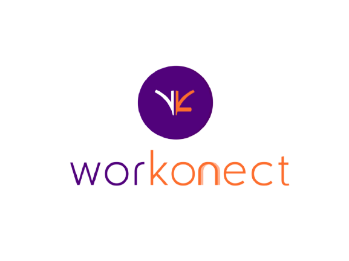
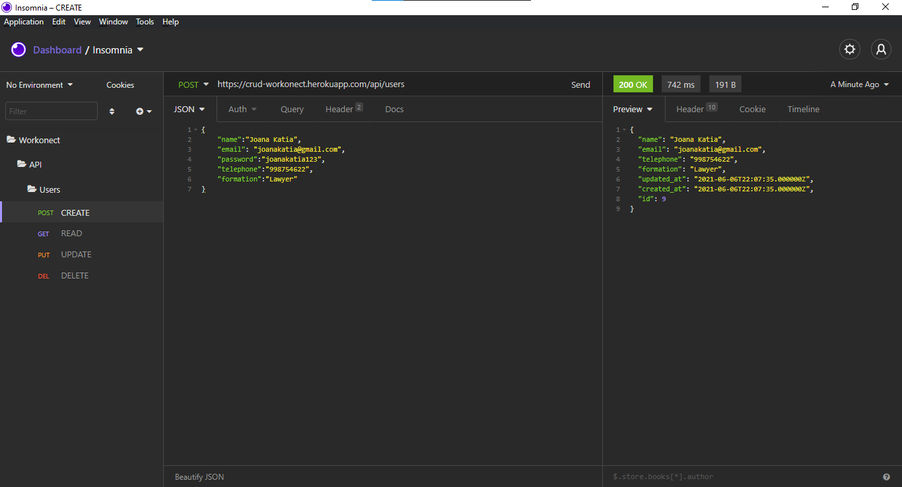
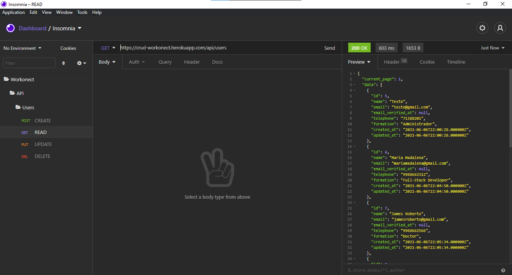
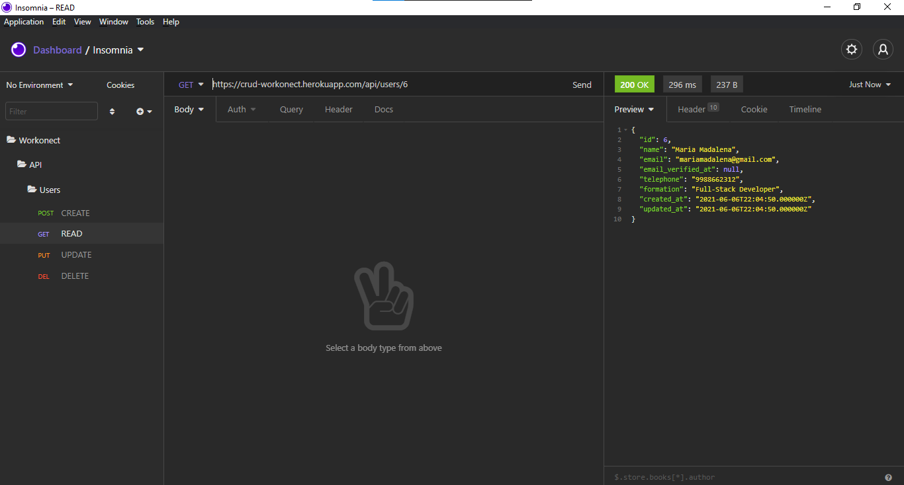
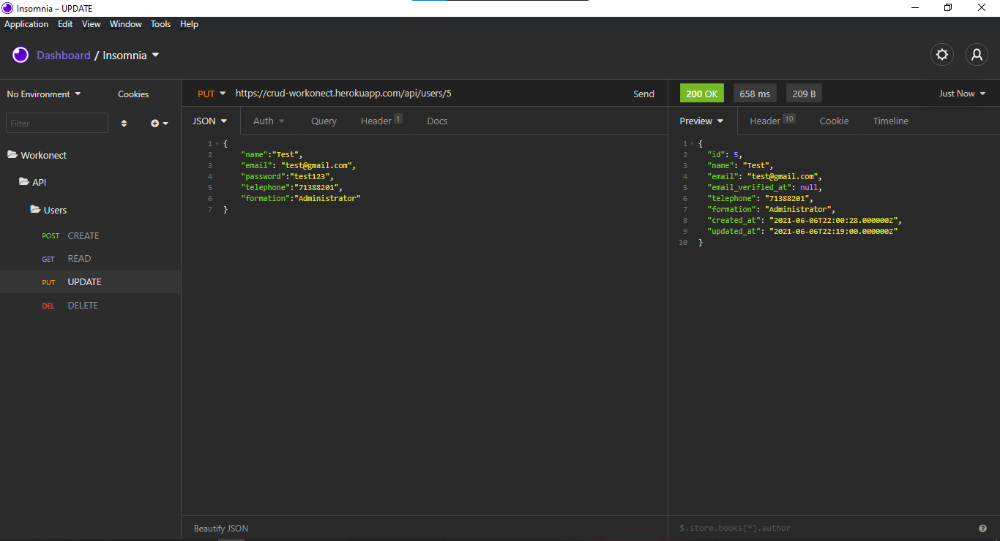
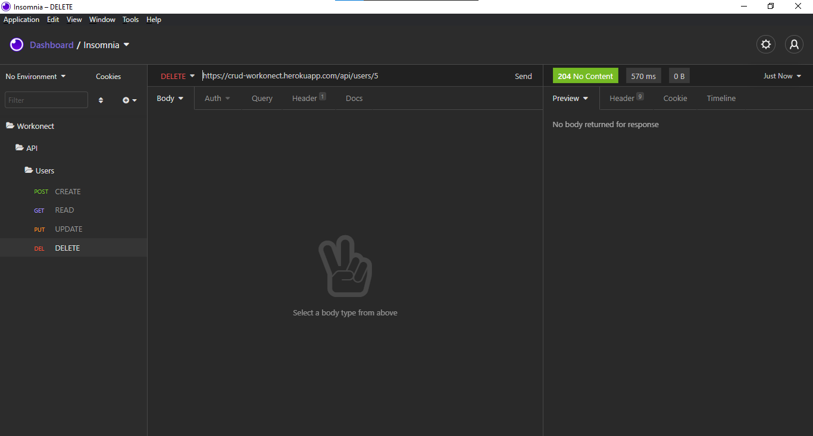

<p align="center"></p><br/>

<h1> Workonect</h1> 
    <p>It is a company focused on reducing bureaucracy in entrepreneurship in Brazil.</p>  
    <p>A platform that, through the Blockchain network, facilitates the acquisition of Tax Address throughout Brazil in less than 1 hour without leaving home.</p>

<br/>

<h1>Information:</h1>
    <p>This project was developed with the objective of fulfilling the challenge proposed in the interview with the Workonect company, which requested the creation of a CRUD of users using the Laravel framework.</p>

<br/>

<h1>Requirements:</h1>
<p>Click on the links to access the documentation:</p>

|Technologies used and their Versions:|
|:------:|
|[PHP](https://prototype.php.net/docs.php) >= 8.0.6|
|[Laravel](https://laravel.com/docs/8.x) >= 4.2.6|
|[XAMPP](https://www.apachefriends.org/docs/) >= 8.0.6|
|[Composer](https://getcomposer.org/doc/) >= 2.0.14|
|[Cmder](https://cmder.net/) >= 1.3.18.1106|
<br/>
<p><strong>Note:</strong> Cmder is interesting for Windows OS users. Linux and Mac don't need it because their system is based on UNIX.</p>

<br/>

<h1>Project:</h1>

**1** - First, clone the repository:
```bash
$ git clone https://github.com/paulacynthia/workonect-crud-back.git
```

**2** - In the project folder, copy the file `.env.example` and rename it to `.env`:
``` bash
$ cp .env.example .env
```

**3** - In the .env file configure the application's environment variables with your information:
``` env
DB_CONNECTION=mysql

DB_HOST=127.0.0.1

DB_PORT=3306

DB_DATABASE=crud

DB_USERNAME=root

DB_PASSWORD=
```

**4** - Run the command below to get the packages needed to start the project:
``` bash
$ composer install
```

**5** - To generate the application key:
``` bash
$ php artisan key:generate
```

**6** - Create the database in phpMyAdmin: 
``` 
CREATE DATABASE crud;
```
<p><strong>Note:</strong> The database name must be referenced in the .env file in the environment variables.</p>

**7** - Upload Migrations to database:
``` bash 
$ php artisan migrate 
```

<p><strong>Note:</strong> If you add the <code>--seed</code> parameter you will populate the database with information.</p>

**8** - Server startup locally:
``` bash
$ php artisan serve
```
    
**9** - To see if it's working, open your browser and go to: `http://127.0.0.1:8000` or also: `http://localhost:8000`.
  
<br/>
    
<h2>Deploy:</h2>

<a href="https://crud-workonect.herokuapp.com/api/users"></a>

<br/>

<h1>API Information:</h1>
<p>The Endpoints supported by the API are:</p>


`POST`
|Endpoints      | Description                      
|:------|:------|
|`/api/users`   | Registers a new user.

<br/>

`GET`
|Endpoints      | Description 
|:------|:------|
|`/api/users`   | Returns information for all users.
|`/api/users/{id}`| Returns information for a specific user.

<br/>

`PUT`
|Endpoints      | Description
|:------|:------| 
|`/api/users/{id}`| Updates specific information.

<br/>

`DELETE`
|Endpoints      | Description
|:------|:------|
|`/api/users/{id}`| Delete specific information.

<br/>

<h1>Application demonstration:</h1>
<p>Using Insomnia:</p>

<br/>

<p>Creating a user using the POST method:</p>


<br/>

<p>Viewing all users created using the GET method:</p>


<br/>

<p>Viewing a specific user via {id}:</p>


<br/>

<p>Update of a specific user via {id} via PUT method:</p>


<br/>

<p>Removal of a specific user via {id} via the DELETE method:</p>


<br/>

<h1>Features</h1>

- [x] User creation (Create);
- [x] Viewing users or specific user (Read);
- [x] Update for a specific user (Update);
- [x] Removal of a specific user (Delete).

<br/>

<h4 align="center">
   Challenge concluded! :heavy_check_mark:
</h4>
